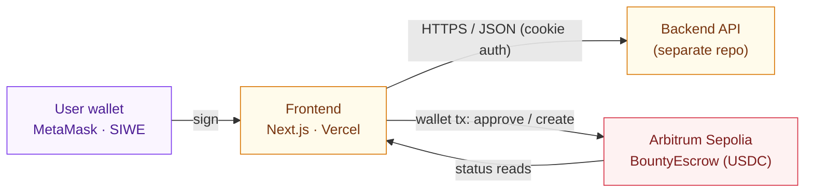

<div align="center">

# DevBounty - Frontend

**The web app for a decentralized bug-bounty platform.**
Connect a wallet, fund bounties in USDC, get paid automatically when your fix is merged.

[](LICENSE)
[](.)
[](.)
[](.)
[](.)
[](.)
[](#testing)
[](#status)

</div>

---

## What it is

DevBounty lets a project owner put real money behind a bug report without trusting a middleman.
A sponsor funds a bounty in **USDC** held by an on-chain escrow; a hunter fixes the issue and opens
a pull request; when a maintainer merges it, the escrow releases the funds on-chain.

This repository is the **frontend** - the interface sponsors and hunters use to connect a wallet,
browse and fund bounties, claim work, and track payouts and reputation. It is read-and-act UI only:
it never holds funds or decides payouts. It reads the chain, talks to the backend API, and prompts
the wallet to sign. The API and the smart contract live in a separate repository.

---

## Capabilities

- **Wallet identity.** Connect a wallet and sign in with Ethereum (SIWE), then link a GitHub
  account - both required before claiming, with session state kept in a httpOnly cookie.
- **Browse & fund.** A filterable, paginated bounty board, and a guided wizard to create a bounty
  and fund it with an on-chain USDC `approve` + escrow `create`.
- **Claim to payout.** Claim a bounty, attach a pull request, and follow its status through to a
  confirmed on-chain payout, including a maintainer panel for the repo owner.
- **Reputation.** Public hunter profiles and a global earnings leaderboard sourced from the API.
- **Self-custodial by design.** The app holds no secrets and no funds; every money action is a
  wallet-signed transaction the user approves, and on-chain actions activate only once the escrow
  address is configured.
- **Demo mode.** An offline fixture mode renders the full UI with no backend or wallet, for quick
  previews.

---

## Status

| Capability | State | What it needs |
|---|---|---|
| UI (board, detail, create, profiles, leaderboard, dashboard) | Built · 34 tests green | - |
| Wallet login (SIWE) + GitHub linking | Built against the API | - |
| On-chain funding (USDC approve + escrow create) | Live on Arbitrum Sepolia | - |
| Hosted on the internet | Live on Vercel | - |
| Real money | Test USDC only | mainnet escrow + audit |

---

## Deployed contracts

Live and source-verified on **Arbitrum Sepolia** (testnet):

| Contract | Address |
|---|---|
| BountyEscrow | [`0x8B71467B545aEdC0F4fc2094c46efEe2CB47Da9F`](https://sepolia.arbiscan.io/address/0x8B71467B545aEdC0F4fc2094c46efEe2CB47Da9F#code) |
| USDC (mock) | [`0x3FD372BF3AE46539e5F07D9Bc00c2E5dfA0F0E2e`](https://sepolia.arbiscan.io/address/0x3FD372BF3AE46539e5F07D9Bc00c2E5dfA0F0E2e#code) |

---

## Tech stack

| Layer | Stack |
|---|---|
| Framework | Next.js 14 (App Router) · React · TypeScript |
| UI | Tailwind CSS · Framer Motion · custom design system |
| Wallet / chain | wagmi v2 · viem · RainbowKit · SIWE (auth) |
| Data / state | TanStack Query · Zustand |
| Target chain | Arbitrum Sepolia (testnet) |
| Tests | Vitest · React Testing Library (jsdom) |

The backend (Express, MongoDB) and the escrow contract (Solidity, Hardhat) live in a separate
repository.

---

## Architecture



The frontend reads bounty data from the API and reads or writes the chain through the user's
wallet. It carries no secrets - all client config is `NEXT_PUBLIC_*`.

---

## Getting Started

Uses **pnpm** (enable with `corepack enable`).

```bash
pnpm install
cp .env.example .env.local   # fill in the NEXT_PUBLIC_* values
pnpm dev                     # http://localhost:3000
```

The API is expected at `http://localhost:4000` by default (cookie auth, sent automatically).

## Testing

```bash
pnpm typecheck
pnpm lint
pnpm test       # 34 tests (Vitest + React Testing Library)
pnpm build
```

---

## License

[MIT](LICENSE) © 2026 ozpool
